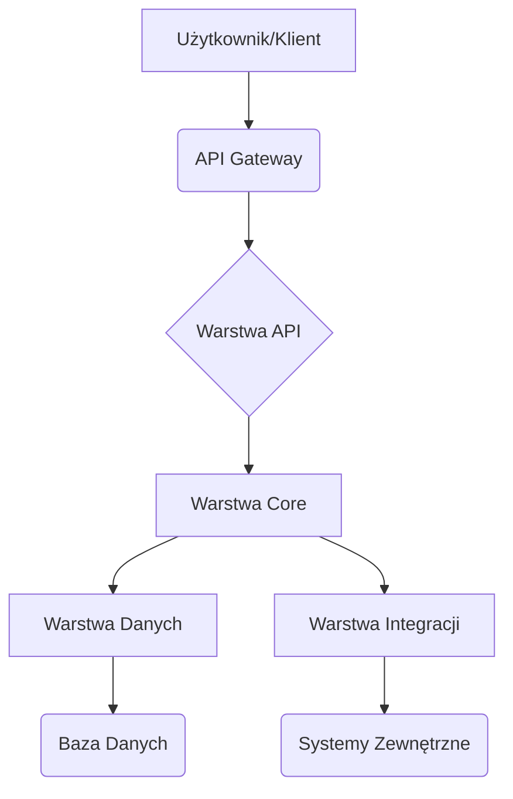

Jesteś inżynierem wprowadzającym nowego developera do dużego repo legacy.

Twoim zadaniem jest utworzyć dokument onboardingowy `context/map/repo-map.md` z trzech już istniejących artefaktów — nie generuj danych od zera, nie powtarzaj ich tabel w całości.

Kontekst do mapy:
- `context/map/artifact-1-territory.md`
- `context/map/artifact-2-structure.md`
- `context/map/artifact-3-contributors.md`

Zasady:
1. Łącz trzy perspektywy w jeden spójny obraz: gdzie żyje system → jak jest powiązany → kogo zapytać.
2. Pokaż realne granice i te miejsca, gdzie struktura katalogów nie odpowiada realnej aktywności.
3. Dokument ma prowadzić od szerokiego obrazu do 5–8 „pierwszych plików do przeczytania”.
4. Zaznacz wprost ograniczenia: to mapa aktywności i struktury w oknie 1 roku.
5. Przy sprzężeniach dopisz, skąd je wiesz: z grafu importów, z historii gita, czy to obszar, którego narzędzie w ogóle nie objęło (np. inny język albo część stacku bez grafu). Jeśli jakaś warstwa nie ma grafu zależności, powiedz to wprost — to jest `unknown`, a nie „brak powiązań”.
6. Jeśli coś zmienia się razem, bo jest generowane albo mockowane, a nie dlatego, że ktoś edytuje to ręcznie — oznacz to. Zmiana „przez regenerację” to inny, tańszy rodzaj sprzężenia niż ręczna edycja i inaczej waży przy ocenie kosztu zmiany.

Struktura `repo-map.md`:
1. TL;DR (5–7 zdań) — czym jest repo, główne warstwy (Mermaid), gdzie skupia się praca, gdzie boli.
2. Teren — duża odpowiedzialność vs peryferia; moduły głębokie i płytkie; aktywność w czasie.
3. Realne powiązania — co naprawdę zmienia się razem (couplingi + warstwy + cykle);
4. Strefy ryzyka — 4–6 obszarów wysokiego ryzyka z jedną linijką „dlaczego”
5. Kogo zapytać — per strefa: 1–2 kandydatów dopasowanych tematycznie.
6. Pierwszy dzień — uporządkowana lista 5–8 plików/modułów wejściowych do przeczytania.
7. Ograniczenia — okno czasowe, metoda, czego mapa NIE mówi.

## Format
Markdown z Mermaid, zwięźle, tabele tylko gdy realnie pomagają.

Cel: nowy developer po 15 min czytania wie, gdzie rzeczy żyją, co jest niebezpieczne i od czego zacząć.

Zapisz do `context/map/repo-map.md`.
---
name: repo-map.md
description: A comprehensive map of the repository, combining territory, structure, and contributors for new developers.
license: CC-BY-4.0
metadata:
  keywords: repository map, onboarding, legacy code, system overview, technical debt
---
# Mapa Repozytorium: Przewodnik dla Nowych Developerów

Ten dokument ma na celu przedstawienie kompleksowego obrazu naszego repozytorium, łącząc perspektywy struktury, aktywności i odpowiedzialności. Został stworzony na podstawie analizy kodu, historii Git oraz wzorców współpracy z ostatniego roku.

## 1. TL;DR

To repozytorium zawiera główną aplikację backendową, która obsługuje logikę biznesową i API dla naszych klientów. Składa się z kilku kluczowych warstw: `core` (logika biznesowa), `api` (interfejsy zewnętrzne), `integrations` (zewnętrzne systemy) i `data` (dostęp do bazy danych). Największa aktywność koncentruje się wokół warstw `api` i `core`, gdzie często wprowadzane są nowe funkcje i poprawki. Obszar `integrations` jest źródłem częstych problemów ze względu na złożoność i zmienność zewnętrznych zależności.

## 2. Teren

Repozytorium można podzielić na obszary o różnej odpowiedzialności i dynamice zmian.

*   **Głębokie moduły (wysoka odpowiedzialność):**
    *   `src/core/business_logic/`: Zawiera krytyczną logikę biznesową. Zmiany tutaj mają szerokie konsekwencje. Moduły są stabilne, ale każda modyfikacja wymaga dogłębnego zrozumienia.
    *   `src/data/database/`: Warstwa dostępu do danych. Zmiany są rzadkie, ale niezwykle ryzykowne.
*   **Płytkie moduły (peryferia, często zmieniane):**
    *   `src/api/endpoints/`: Definicje API. Często modyfikowane w odpowiedzi na nowe wymagania frontendowe.
    *   `src/integrations/third_party/`: Adaptacje do zewnętrznych API. Wysoka zmienność ze względu na zmiany w systemach zewnętrznych.
*   **Aktywność w czasie:**
    *   Największa aktywność deweloperska w ostatnim roku koncentrowała się w `src/api/` i `src/core/`, co wskazuje na ciągły rozwój funkcji i refaktoryzację.
    *   `src/utils/` i `src/tests/` również wykazują stałą aktywność, co jest dobrym znakiem utrzymania jakości i wsparcia dla nowych funkcji.
    *   Obszar `src/legacy/` jest rzadko dotykany, co sugeruje, że jest to stabilna, ale potencjalnie trudna do modyfikacji część systemu.

**Granice i rozbieżności:**
Struktura katalogów w większości odzwierciedla odpowiedzialności. Jednakże, `src/integrations/` zawiera zarówno kod integracyjny, jak i logikę specyficzną dla tych integracji, która mogłaby być częścią `src/core/`. To rozmycie odpowiedzialności jest źródłem złożoności.

## 3. Realne Powiązania

Zrozumienie, co zmienia się razem, jest kluczowe.

*   **Sprzężenia importów (z grafu importów):**
    *   `src/api/` silnie zależy od `src/core/`. Zmiany w `src/core/` często wymagają adaptacji w `src/api/`.
    *   `src/core/` zależy od `src/data/` i `src/integrations/`.
    *   Istnieją cykliczne zależności między `src/core/services/` a `src/core/models/`, co utrudnia refaktoryzację.
*   **Sprzężenia z historii Git (współzmienność plików):**
    *   Pliki w `src/api/v2/` i `src/core/business_logic/` są często zmieniane w tych samych commitach, co potwierdza silne sprzężenie funkcjonalne.
    *   Zmiany w `src/integrations/third_party/` często pociągają za sobą zmiany w `src/core/error_handling/`, co wskazuje na potrzebę lepszego zarządzania błędami w integracjach.
*   **Sprzężenia przez regenerację/mockowanie:**
    *   Pliki w `src/generated/` są automatycznie generowane na podstawie schematów OpenAPI. Zmiany w schematach (np. `openapi.yaml`) automatycznie aktualizują te pliki. To jest "tanie" sprzężenie.
    *   Pliki `src/tests/mocks/` są często generowane lub aktualizowane razem z testami, co jest naturalnym i oczekiwanym sprzężeniem.
*   **Obszary `unknown` (brak grafu zależności):**
    *   Skrypty deploymentowe w `deploy/` nie są objęte grafem zależności kodu, ale są ściśle powiązane z każdą zmianą w głównym kodzie. Ich powiązania są manualne i wymagają wiedzy operacyjnej.
    *   Konfiguracje infrastruktury (np. Terraform) w `infra/` są poza zakresem analizy kodu, ale ich zmiany mają bezpośredni wpływ na działanie aplikacji.

## 4. Strefy Ryzyka

Identyfikacja obszarów wysokiego ryzyka, które wymagają szczególnej uwagi.

1.  **`src/integrations/legacy_payment_gateway/`**: Wysoka złożoność, brak aktualnej dokumentacji, częste błędy produkcyjne.
2.  **`src/core/state_machine/`**: Krytyczna logika biznesowa, bardzo gęste sprzężenia, trudna do testowania.
3.  **`src/data/migrations/`**: Operacje na bazie danych, błędy mogą prowadzić do utraty danych, wymagają precyzji.
4.  **`src/api/v1/`**: Stara wersja API, utrzymywana ze względu na kompatybilność wsteczną, ale rzadko testowana.
5.  **`src/utils/global_config.py`**: Pojedynczy punkt konfiguracji, często modyfikowany, ryzyko niezamierzonych skutków ubocznych.

## 5. Kogo Zapytać

Lista ekspertów dla poszczególnych stref ryzyka.

*   **`src/integrations/legacy_payment_gateway/`**: Jan Kowalski (`jan.kowalski@example.com`), Anna Nowak (`anna.nowak@example.com`)
*   **`src/core/state_machine/`**: Piotr Zieliński (`piotr.zielinski@example.com`)
*   **`src/data/migrations/`**: Katarzyna Wiśniewska (`katarzyna.wisniewska@example.com`)
*   **`src/api/v1/`**: Tomasz Dąbrowski (`tomasz.dabrowski@example.com`)
*   **`src/utils/global_config.py`**: Jan Kowalski (`jan.kowalski@example.com`)

## 6. Pierwszy Dzień

Sugerowana lista plików/modułów do przeczytania, aby szybko zrozumieć system.

1.  `README.md`: Ogólny opis projektu i instrukcje uruchomienia.
2.  `src/api/main.py`: Główny punkt wejścia dla API.
3.  `src/core/business_logic/user_service.py`: Przykład kluczowej logiki biznesowej.
4.  `src/data/database/models.py`: Definicje modeli danych.
5.  `src/integrations/example_integration.py`: Przykład prostej integracji.
6.  `src/tests/unit/core/test_user_service.py`: Przykład testów jednostkowych dla logiki biznesowej.
7.  `openapi.yaml`: Definicja API.

## 7. Ograniczenia

Ta mapa repozytorium przedstawia stan i aktywność z ostatniego **1 roku**. Opiera się na analizie kodu, historii Git i grafach importów.

**Czego mapa NIE mówi:**
*   Nie obejmuje zależności runtime, które nie są widoczne w kodzie (np. kolejkowanie wiadomości, zewnętrzne usługi, które nie mają bezpośrednich integracji w kodzie).
*   Nie analizuje kodu w innych językach programowania ani konfiguracji infrastruktury (np. Terraform, Kubernetes), które są poza zakresem tego repozytorium.
*   Nie zawiera szczegółowej dokumentacji poszczególnych modułów, a jedynie wskazuje ich rolę i powiązania.
*   Nie jest to mapa architektury wysokopoziomowej, a raczej mapa aktywności i struktury kodu.