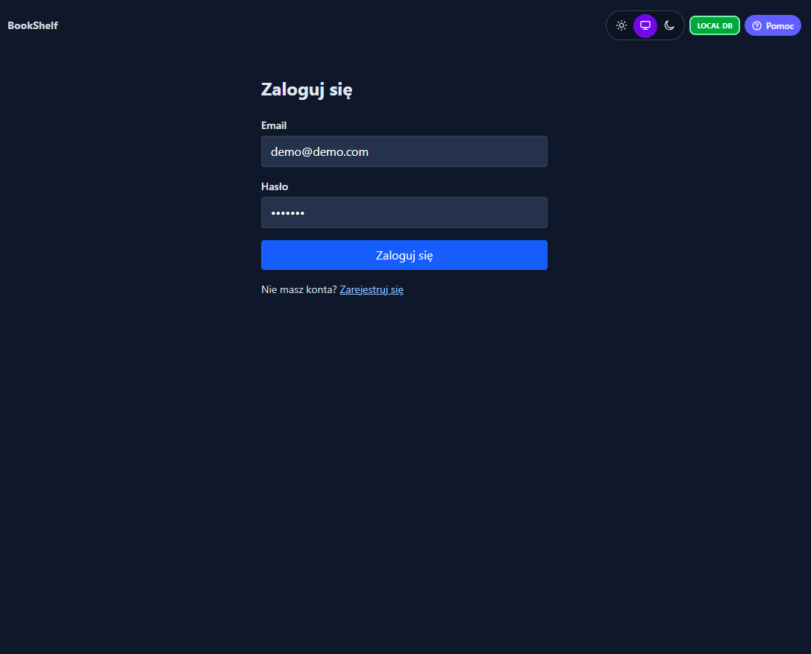
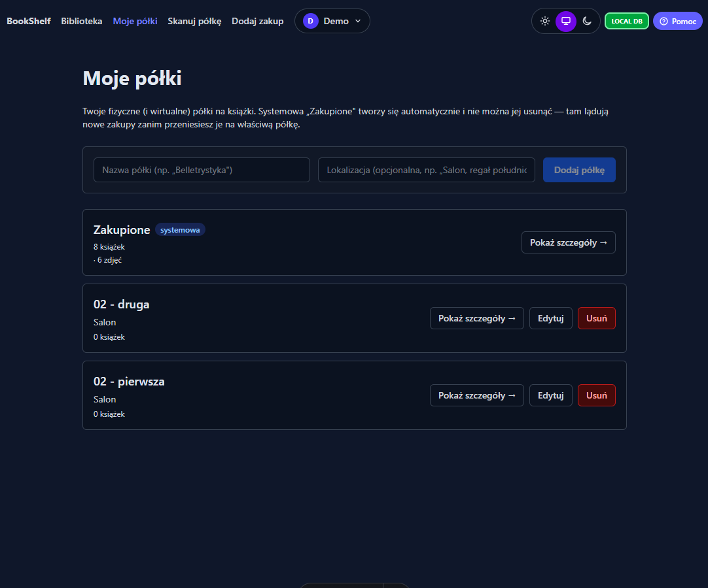
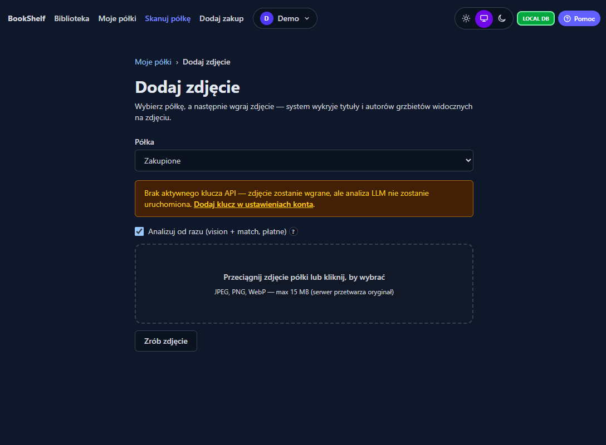
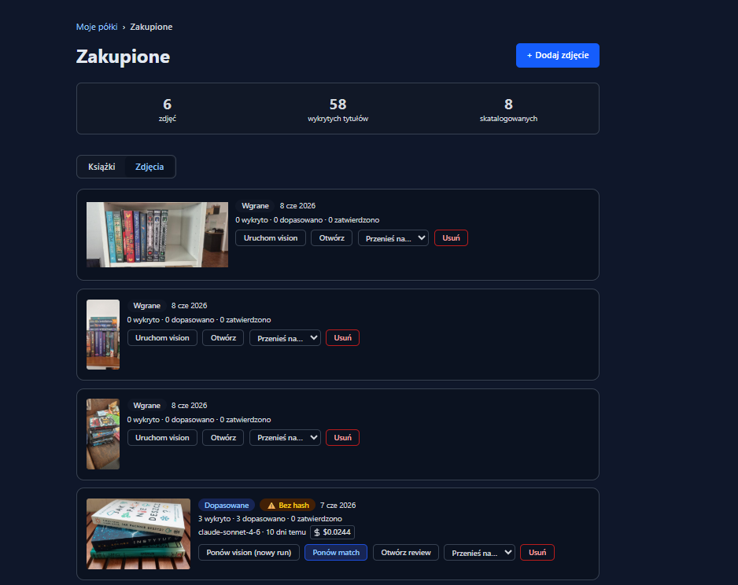
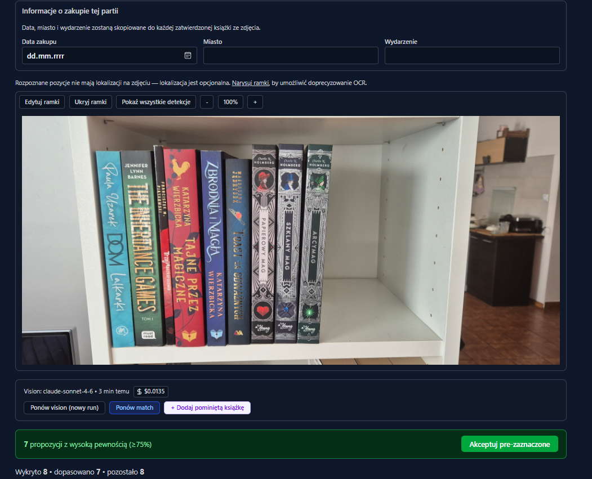
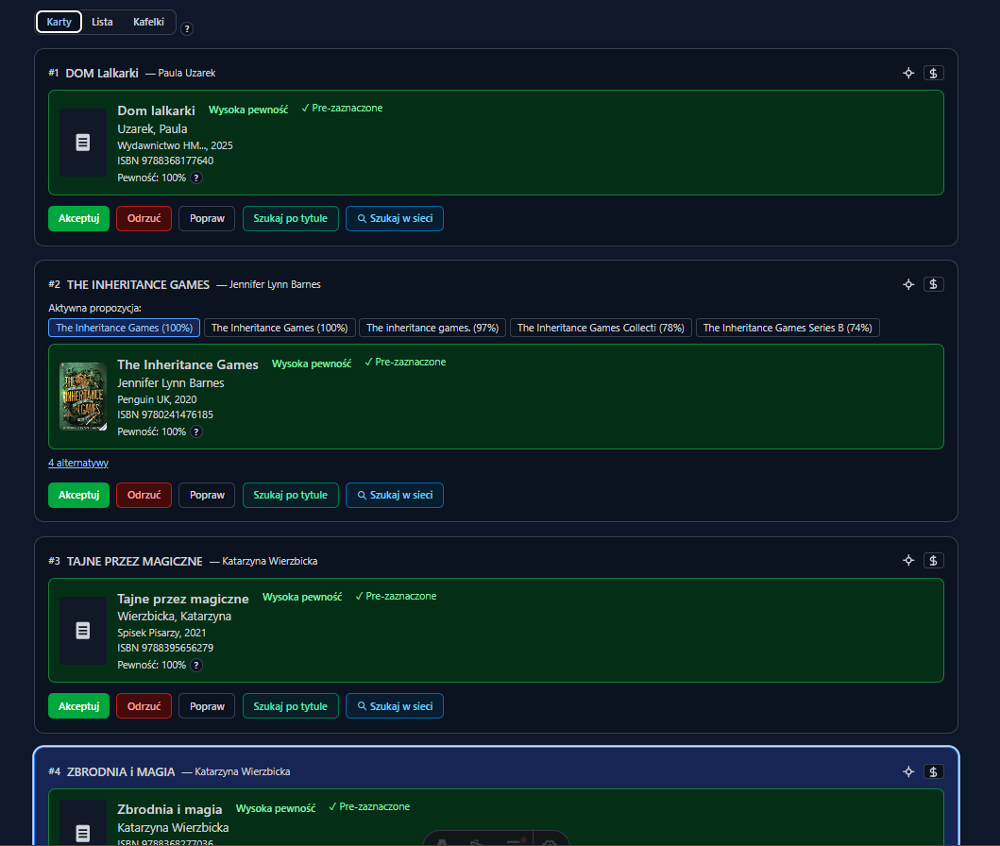
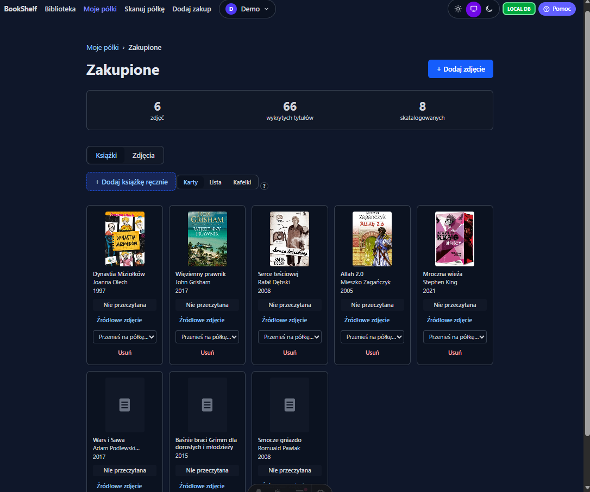
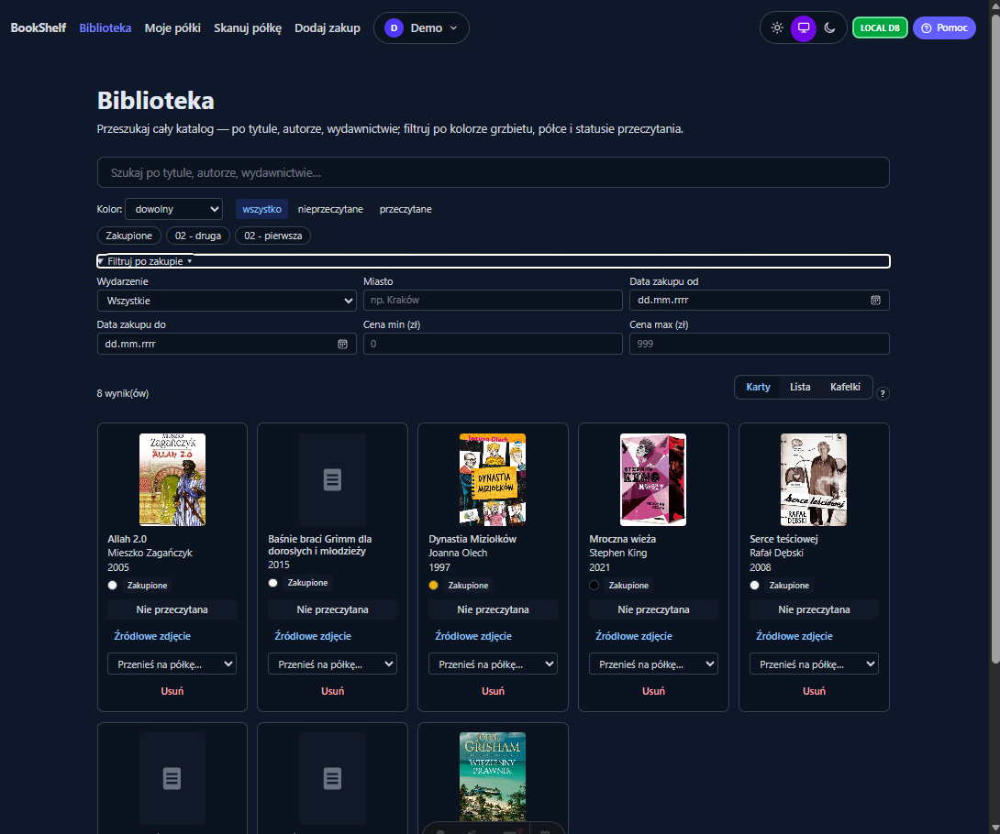
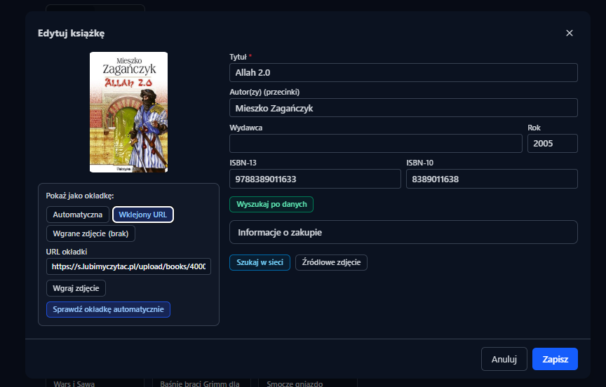
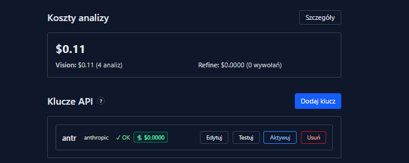

# BookShelf Catalog

Aplikacja webowa do katalogowania domowej biblioteczki na podstawie zdjęć półek.
Fotografujesz półkę, vision-LLM rozpoznaje tytuły, system sam matchuje je z bazą
zewnętrzną i proponuje wpisy z lokalizacją — tobie zostaje akceptacja lub korekta.

> **Projekt zaliczeniowy 10xDevs 3.0** — start kursu 18.05.2026, oddanie 5.07.2026.

## O projekcie

Po wgraniu zdjęcia półki aplikacja:

1. **Detekcja** — Claude Sonnet 4.6 (multimodal) wyciąga listę widocznych tytułów i autorów.
2. **Matching** — Google Books / OpenLibrary dostarczają metadane (ISBN, okładkę, autora).
3. **Deduplikacja** — sprawdzenie, czy książka już jest w twoim katalogu.
4. **Ranking** — propozycje uporządkowane wg pewności matchu.
5. **Potwierdzenie** — ty akceptujesz, odrzucasz lub korygujesz; system uczy się z korekt.

W jednym zdaniu: **zdjęcie → detekcja → match → dedup → ranking → potwierdzenie**.

## Screenshots

### Autentykacja i półki

| | |
|---|---|
|  |  |
| *Logowanie — Supabase Auth (email + hasło)* | *Moje półki — CRUD, lokalizacja w domu; półka „Zakupione" tworzy się automatycznie przy rejestracji* |

### Skanowanie półki

| | |
|---|---|
|  |  |
| *Dodaj zdjęcie — wybór półki, opcja „Analizuj od razu" (vision + auto-match w jednym kroku)* | *Zdjęcia na półce — status per zdjęcie (wykryto · dopasowano · zatwierdzono), koszt, akcje: ponów vision / match* |

### Detekcja AI i auto-matching

| | |
|---|---|
|  |  |
| *Claude Sonnet 4.6 (multimodal) — wykryte tytuły i autorzy z grzbietów na realnym zdjęciu półki* | *Auto-matching po vision — kandydaci z Google Books / OpenLibrary, score (pre-zaznaczone ≥ 75%), ISBN, alternatywy; Akceptuj / Odrzuć / Popraw* |

### Katalog i wyszukiwanie

| | |
|---|---|
|  |  |
| *Półka „Zakupione" — karty z okładkami, statystyki (wykryto / skatalogowano), przenoszenie między półkami* | *Biblioteka — pełnotekstowe wyszukiwanie po tytule / autorze / wydawnictwie, filtry: półka, kolor grzbietu, cena i data zakupu* |

### Zarządzanie książką i profil

| | |
|---|---|
|  |  |
| *Edycja wpisu — tytuł, autor, ISBN-13/10, okładka (auto / URL / własne zdjęcie), dane zakupu* | *Profil — BYOK klucze API (Anthropic / OpenAI / OpenRouter), monitoring kosztów vision per analiza* |

## Stack

| Warstwa | Wybór |
|---|---|
| Meta-framework | Astro 6 (SSR) |
| UI | React 19 (islands) |
| Style | Tailwind 4 |
| Typy | TypeScript strict |
| Backend | Astro endpoints (`src/pages/api/`) |
| Auth | Supabase Auth (email + hasło) |
| DB | Supabase Postgres + RLS |
| Storage | Supabase Storage (zdjęcia półek) |
| Vision LLM | Claude Sonnet 4.6 przez Anthropic API |
| Walidacja LLM I/O | Zod |
| Metadane książek | Google Books (primary) + OpenLibrary (fallback) |
| Deployment | Cloudflare Workers (z Workers Assets) |
| Testy | Vitest (unit) + Playwright (E2E) |
| CI | GitHub Actions |

## Architektura

```
Browser (React 19 islands) ─→ Astro SSR (Cloudflare Workers + Assets)
                                   │
            ┌──────────────────────┼──────────────────────┐
            ▼                      ▼                      ▼
       Supabase Auth         Supabase Postgres      Supabase Storage
       (JWT + sesja)         (RLS na user_id)       (zdjęcia półek)
                                   │
                                   ▼
            ┌──────────────────────┼──────────────────────┐
            ▼                      ▼                      ▼
       Anthropic API          Google Books API        OpenLibrary API
       (Sonnet 4.6 vision)    (primary metadata)      (fallback)
```

## Szybki start

Wymagania: **Node.js ≥ 22.13.0**, `npm`, konto Supabase, klucz Anthropic API.

```powershell
# 1. Klon i zależności
git clone git@github.com:dariuszdanowski/bookshelf.git
cd bookshelf
npm install

# 2. Zmienne środowiskowe
Copy-Item .env.example .env.local
# Uzupełnij PUBLIC_SUPABASE_URL, klucze Supabase, ANTHROPIC_API_KEY

# 3. Dev server
npm run dev
# → http://localhost:4321/
```

### Komendy

| Komenda | Co robi |
|---|---|
| `npm run dev` | Dev server na `localhost:4321` z HMR |
| `npm run build` | Produkcyjny build do `dist/` (bundle pod Cloudflare Workers) |
| `npm run preview` | Preview produkcyjnego buildu lokalnie |
| `npm run typecheck` | TypeScript typecheck (`astro check`) |
| `npm run lint` | ESLint v9 flat config |
| `npm run format` | Prettier |
| `npm run test` | Vitest — testy jednostkowe |
| `npm run test:e2e` | Playwright — testy E2E (pierwsze uruchomienie: `npx playwright install --with-deps`) |
| `npm run generate-types` | Wygeneruj typy z Cloudflare bindings (`wrangler types`) |

### Git hooks (Lefthook)

Hooki instalują się automatycznie przy `npm install` (postinstall). Konfiguracja w [`lefthook.yml`](lefthook.yml):

- **pre-commit** — `eslint --fix` + `prettier --write` na staged files (auto-fixy wracają do stage'a)
- **pre-push** — `npm run typecheck` (`astro check`, ~20–30 s)

Pominięcie w awaryjnej sytuacji: `LEFTHOOK=0 git commit ...`. Pełne bramki (testy, build, E2E) zostają w CI.

## Struktura katalogów

```
bookshelf/
├── src/
│   ├── pages/              # Astro pages + /api/ endpointy
│   ├── components/         # React islands (PhotoUploader, DetectionReview…)
│   ├── layouts/            # Astro layouts
│   ├── styles/             # Tailwind entry
│   └── lib/
│       ├── vision/         # klient Anthropic + prompt + Zod schema
│       ├── books/          # Google Books + OpenLibrary + reconcile
│       ├── matching/       # score, dedupe, ISBN
│       ├── db/             # Supabase typed clients (server/browser)
│       └── auth/           # middleware guard
├── supabase/
│   ├── migrations/         # SQL migracje + RLS policies
│   └── seed.sql
├── tests/
│   ├── unit/               # Vitest
│   ├── integration/
│   └── e2e/                # Playwright (z mock vision-response)
├── docs/
│   ├── prd.md              # PRD modułu
│   └── plan-implementacji.md
└── .github/workflows/      # ci.yml: lint+typecheck+vitest+playwright(E2E, lokalna Supabase) · deploy.yml: build+deploy
```

## Status i dokumentacja

| Plik | Co tam jest |
|---|---|
| [docs/prd.md](docs/prd.md) | PRD modułu — wymagania funkcjonalne, schemat danych (8 tabel) |
| [docs/plan-implementacji.md](docs/plan-implementacji.md) | Kalendarz milestonów, ryzyka, definition of done |
| [docs/self-review.md](docs/self-review.md) | Self-review pod 6 wymogów certyfikacji 10xDevs 3.0 — z dowodami |
| [CLAUDE.md](CLAUDE.md) | Kontekst i konwencje pracy z agentem AI |

### Harmonogram

| Milestone | Termin | Zakres |
|---|---|---|
| M0 — bootstrap | 17.05.2026 | Astro + Tailwind + React + Cloudflare ✓ |
| M1 — schema + upload + vision | 31.05.2026 | Auth, RLS, upload zdjęcia, vision call ✓ |
| M2 — matching + katalog | 14.06.2026 | Books API, scoring, dedup, UI review ✓ |
| M3 — CI/CD + szlif | 19.06.2026 | GitHub Actions, deploy CF Workers, demo 🔄 |

## Świadomie poza MVP

Mobile app / PWA, camera capture w przeglądarce, skanowanie ISBN czytnikiem
kodów kreskowych, batch upload wielu zdjęć, rekomendacje „co przeczytać",
eksport CSV/JSON, shared shelves między userami, dziennik czytania —
wszystko kandyduje na post-19.06, poza zakresem MVP.

## Licencja

MIT — zobacz [LICENSE](LICENSE).
